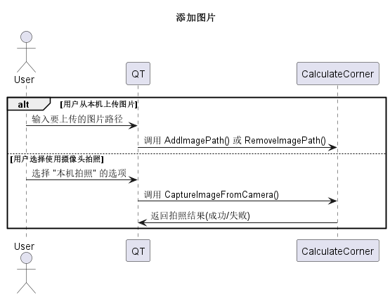
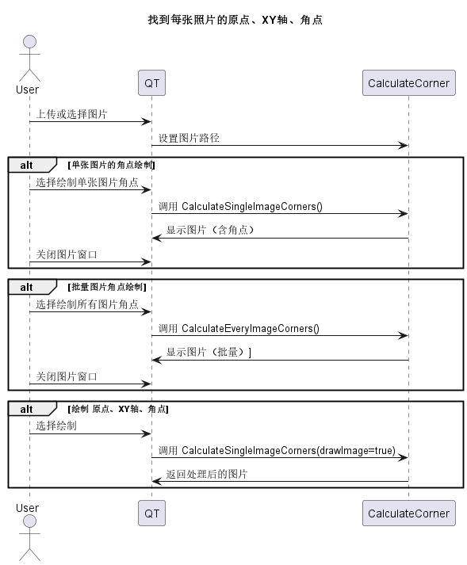
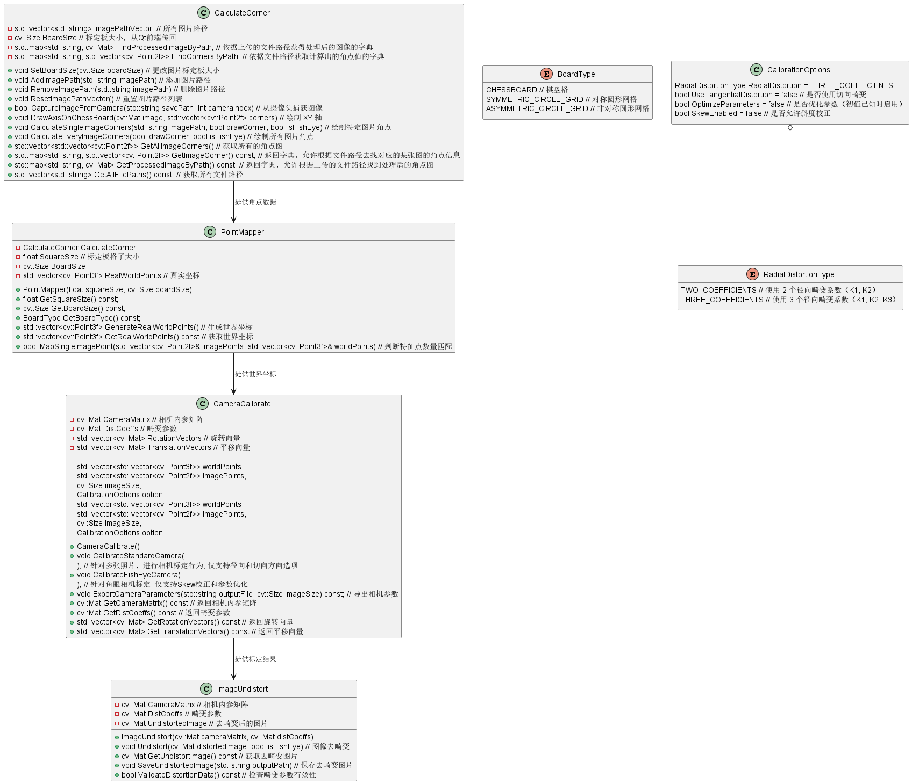

## 同济大学计算机视觉期末项目
### 11.19
- 完成[相机标定功能](./Resources/相机标定功能.pdf)文件的大部分功能  
**TODO**:  
- [ ] 对代码进行测试
    - [x] 添加照片（上传图片/拍摄） (11.23)
    - [x] 选择标定板模式、格子大小、畸变程度 (11.25，未测试畸变程度)
    - [x] 找到每张照片的原点、XY轴、角点 (11.23)
    - [x] 选择相机是标准相机还是鱼眼相机,以及其配置项 11.25
    - [ ] 标定行为 
    - [ ] 标定得到的结果 
    - [x] 导出相机参数 11.25
- [ ] 检查提供的照片是否满足要求
- [ ] 更新类图和用例图

### 11.23
- 更新代码结构，CV_DLL为**dll**项目，输出为dll包，输出位置为`Resources\ReleasedDLL`
- 新建测试项目`UnitTest`,实现对功能1、3测试
- 更新相应流程图,CalculateCorner的类图  
  
  
  
